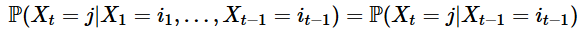

# Hidden-Markov-Model
Following is the python implementation of HMM using Viterbi Algorithm.    
The property a process (Xₜ)ₜ should have to be a Markov Chain is:

Hidden Markov models are probabilistic frameworks where the observed data  are modeled as a series of outputs (or emissions) generated by one of several (hidden/latent) internal states. The model then uses inference algorithms to estimate the probability of each state along every position along the observed data.The parameters of the gHMM include the prior probabilities of entering each state, which are modeled using the transition probabilities between states.

The Viterbi algorithm is a dynamic programming algorithm for finding the most likely sequence of hidden states—called the Viterbi path—that results in a sequence of observed events, especially in the context of Markov information sources and hidden Markov models (HMM).
